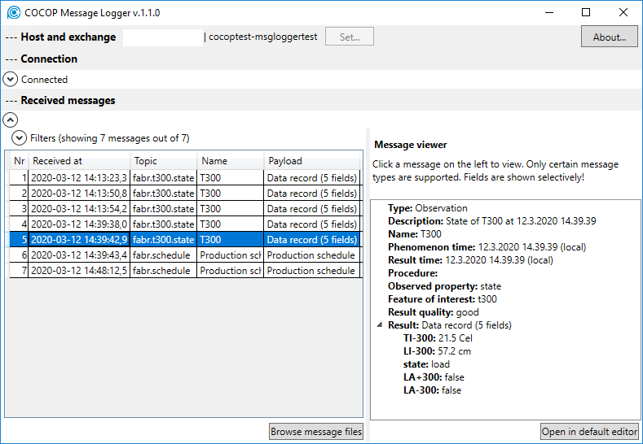

[<< Back to index](index.html)

# COCOP Message Logger

This application logs message traffic in an AMQP message bus. The messages are
stored in the hard disk, and related metadata enables the user to search for
logged messages. Any messages can be logged, and certain message types can be
visualised in a treeview. These types are the ones commonly exchanged in COCOP
project.

## Download

* .NET desktop app: [https://github.com/kannisto/Cocop.MessageLogger](https://github.com/kannisto/Cocop.MessageLogger)

## Authors

* Petri Kannisto, Tampere University, Finland
* Tapio Vaaranmaa, Tampere University, Finland

## Acknowledgement

COCOP - Coordinating Optimisation of Complex Industrial Processes  
[https://cocop-spire.eu/](https://cocop-spire.eu/)

This project has received funding from the European Union's Horizon 2020
research and innovation programme under grant agreement No 723661. This piece
of software reflects only the authors' views, and the Commission is not
responsible for any use that may be made of the information contained therein.
