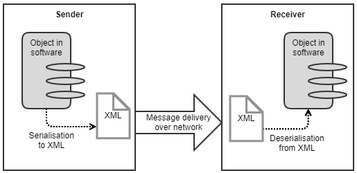

[<< Back to index](index.html)

# Cocop.MessageSerialiser

In this page:

* [Introduction](#introduction)
* [Cocop.MessageSerialiser.Meas](#cocopmessageserialisermeas)
* [Cocop.MessageSerialiser.Biz](#cocopmessageserialiserbiz)

## Introduction

This page introduces the _Cocop.MessageSerialiser_ API to serialise (or encode)
data to enable interoperability in industrial software systems. This page
explains what serialisation means and provides an overview about the data types
and use cases supported by Cocop.MessageSerialiser.

Serialisation (also called encoding) is necessary to communicate data between
software systems and applications in a network. Consider you have an object
that holds fields of data. To communicate the object to another application via
a network, you must first _serialise_ the object. The serialised object is sent
as a message over the network, after which the recipient deserialises the
message to an object. Please see the illustration in the figure below. In the
figure, the serialisation syntax is XML (Extensible Markup Language), which is
commonly supported in software development tools.

Cocop.MessageSerialiser does not restrict which protocol to choose as the
communication medium. Although the API was designed with AMQP (Advanced Message
Queueing Protocol) and RabbitMQ in mind, the choice can as well be MQTT, HTTP
or whatever you find the best.

In industrial communication, there are needs to serialise multiple types of
data. Numeric measurement values are most typical. However, depending on the
use case, you may also need other types, such as booleans, enumeration values,
complex data records and time series. Some scenarios necessitate
request-response communication of these, possibly with filters specified for
requests. In industrial systems, production scheduling is another common need.

To ease the development and upkeep of industrial software, the serialisation
format should apply open standards. Traditionally, industrial communication has
relied on proprietary media, such as fieldbuses or other vendor-specific APIs.
These have strengths, but the communication approach is cheaper to modify and
upkeep if it is _decoupled_ and based on _open standards_. This adds
flexibility to updates and reduces the need for any vendor-specific expertise.
On the other hand, standards enable interoperability between systems, which is
an essential goal in modern systems integration. In some occasions, standards,
such as OPC DA and OPC UA, are already applied. OPC DA has no proper support
for security features and requires a Windows platform. OPC UA solves these
issues but suffers from the lack of scalability.

Cocop.MessageSerialiser API applies standards that enable loosely coupled,
platform-independent systems integration. The chosen standards serialise data
in XML, which does not require any specific platform for the software. With
this API, virtually any software can become interoperable.

Cocop.MessageSerialiser API consists of two parts,
_Cocop.MessageSerialiser.Meas_ and _Cocop.MessageSerialiser.Biz_. The following
sections explain the features in these.

## Cocop.MessageSerialiser.Meas

This API provides the following data structures:

* measurement values of multiple types, such as:
    * numeric (floating point and integer)
    * boolean
    * enumeration value (category)
    * time instant
    * time range
    * array
    * data record of multiple values
* timeseries data (numeric)
* metadata of measurements
* remote control of long-running tasks
* request-response communication of measurements

All the structures are based on existing open standards. The standards have
been published by and are copyrighted to Open Geospatial Consortium (OGC;
https://www.opengeospatial.org/ ). Because the standards are complex and
versatile, the API selectively implements what is considered most important in
industrial systems. To guarantee interoperability, the API implements a
_profile_ that covers a subset of the standards. In addition, there are
COCOP-specific extensions not included in the standards, but these are few.

### Download

* Profile specification (XML): https://github.com/kannisto/Cocop.MessageSerialiser.Meas_spec
* C#/.NET API: https://github.com/kannisto/Cocop.MessageSerialiser.Meas_csharp
* Java API: https://github.com/kannisto/Cocop.MessageSerialiser.Meas_java

### Author

* Petri Kannisto, Tampere University, Finland

## Cocop.MessageSerialiser.Biz

This API provides data structures for the scheduling of production. The structures are based on B2MML (Business to Manufacturing Markup Language), which implements the ANSI/ISA-95 standard. B2MML is copyrighted to Manufacturing Enterprise Solutions Association (MESA International; http://www.mesa.org/en/B2MML.asp ). However, please note that only a subset of B2MML structures is supported in this API, as the API was developed particularly for the needs of the COCOP project. Scheduling is not the only area of B2MML, and this implementation omits even some scheduling-related features.

### Download

* Profile specification (XML): https://github.com/kannisto/Cocop.MessageSerialiser.Biz_spec
* C#/.NET API: https://github.com/kannisto/Cocop.MessageSerialiser.Biz_csharp
* Java API: https://github.com/kannisto/Cocop.MessageSerialiser.Biz_java

### Author

* Petri Kannisto, Tampere University, Finland

## Acknowledgement

COCOP - Coordinating Optimisation of Complex Industrial Processes  
https://cocop-spire.eu/

This project has received funding from the European Union's Horizon 2020
research and innovation programme under grant agreement No 723661. This piece
of software reflects only the authors' views, and the Commission is not
responsible for any use that may be made of the information contained therein.
