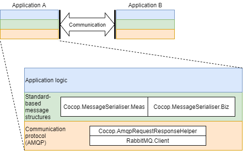

[<< Back to index](index.html)

# COCOP Communication Stack

The COCOP communication stack was developed in the research project COCOP
(Coordinating Optimisation of Complex Industrial Processes). Its intention is
to enable a decoupled and scalable architecture in industrial software systems.
This page provides a brief introduction.

## Structure

The COCOP Communication Stack consists of two layers, namely standard-based
message structures and AMQP as the communication protocol (see the following 
figure). These enable software applications to exchange information regardless
of the runtime or the implementation platform. Such interoperability is an
important factor in an industrial environment, as systems often come from
multiple vendors. In such an environment, the COCOP Communication Stack can 
interconnect any vendor-specific interfaces with an appropriate
adapter. Although adapters generate overhead in design, there is no need to
support multiple interfaces in any system, because the single adapter
enables compatibility with any system connected to the message bus.

In the stack, a core principle is that the layers do not have any dependencies
to each other, which adds flexibility to design. It is possible to modify
either of the layers without affecting to other. Therefore, if desirable,
you can introduce new message types for communication or add another
communication protocol, such as HTTP or MQTT.

## Communication Patterns

### Publish-subscribe

COCOP favours the publish-subscribe communication pattern implemented with a
message bus. In this pattern, data is streamed from the data producers (i.e.,
data sources) and routed to data consumers based on a topic. That is, data is
'pushed' from the source rather than 'pulled' by the consumers. This pattern
does not fit well for all communication needs but excels in scenarios where
data is frequently updated. In such scenarios, publish-subscribe reduces
network traffic, as the consumers do not have to poll for updates. On the other
hand, the pattern facilitates the design of event-based systems where timely
reactions are expected from network nodes.

### Request-response

Because publish-subscribe cannot meet all communication needs, the
request-response pattern is also supported in COCOP. This need stems from the
fact that sometimes the user of data must initiate communication. For example,
consider a situation when you need one or more measurement values for a
particular moment or time period in the past. On the other hand, you may want
to request a network node to perform some action (such as a long-running
simulation task). In this pattern, data is 'pulled' by the consumers rather
than 'pushed' by the producers.

Because a message buses (RabbitMQ, in this case) do not
consider request-response the primary communication pattern, COCOP has
implemented a dedicated API.
Although this functionality does not require lot of coding and the RabbitMQ
website also provide an example, the API saves some work and enables the logic
to be re-used.

## Acknowledgement

COCOP - Coordinating Optimisation of Complex Industrial Processes  
https://cocop-spire.eu/

This project has received funding from the European Union's Horizon 2020
research and innovation programme under grant agreement No 723661. This piece
of software reflects only the authors' views, and the Commission is not
responsible for any use that may be made of the information contained therein.
